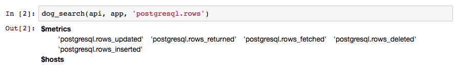
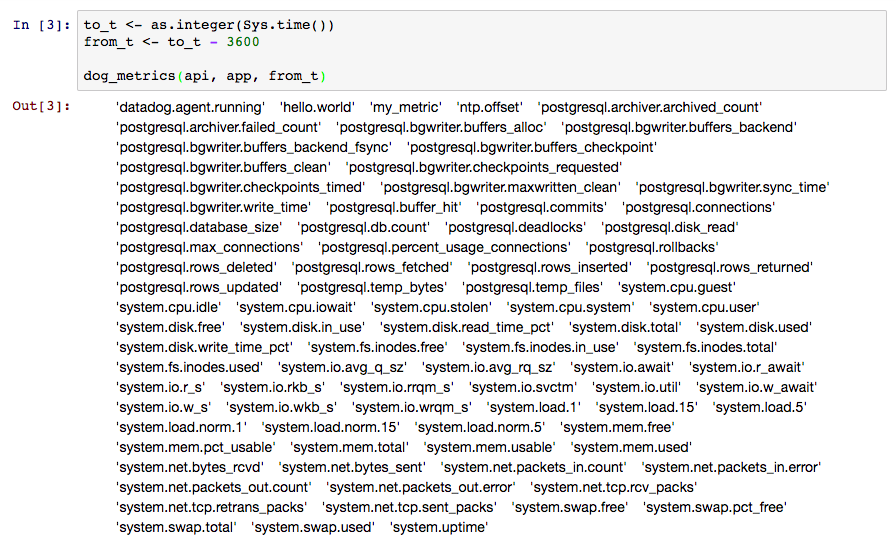
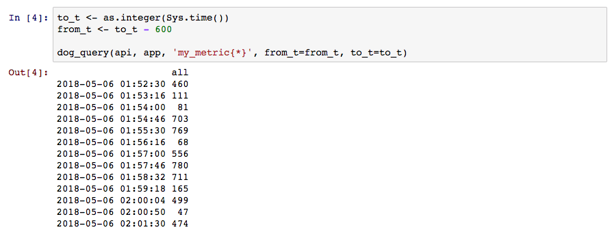
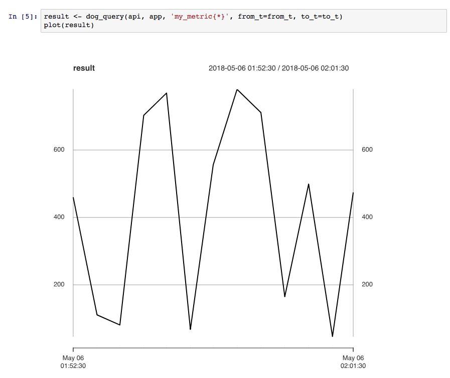
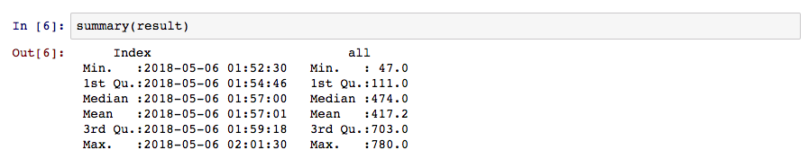

# Analyzing Datadog Metrics In R with rdog


## Why are we using R?

If you've got a background in statistics, data science, or a similar number-crunching field, then you're probably familiar with R already. R is free, open source, and very popular — which means there's a wealth of resources available, including more than 12,000 community-developed [packages](https://cran.r-project.org/web/packages/) to extend and enhance your analytics experience. R doesn't have the world's smoothest learning curve, but if you're a non-programmer who's used to using Excel or SAS for your analytics, R is drastically more versatile and powerful. 

Of course, R isn't for everyone. If you've got more of a background in computer programming, data analysis in Python might be more your speed.

## An R package for Datadog

While Datadog provides quite a few utilities for analyzing and visualizing collected metrics, you may want to integrate Datadog metrics into an existing analytics workflow. Thankfully, the Datadog community has created a diverse collection of [API libraries](https://docs.datadoghq.com/developers/libraries/) that serve just that purpose — including Alexis Lê-Quôc's [rdog](https://github.com/alq666/rdog), a R package that lets you interact with the Datadog API. Let's get started.

## Setting up

To begin, you'll need the following:
- a Datadog API key, which you'll have seen already when you installed your [Datadog Agent](https://docs.datadoghq.com/agent/)
- an application key, which you can create [here](https://app.datadoghq.com/account/settings#api)
- [R](https://www.r-project.org/) installed on your machine — or, alternatively a [Jupyter notebook](http://jupyter.org/)

In your CLI, run the following to install rdog:

```
> install.packages("devtools", repos = "http://cran.us.r-project.org")
  devtools::install_github("datadog/rdog")
  require(rdog)
```

Now, let's set your API and app keys as variables. We'll be referencing these a lot later on.

```
> api <- 'YOUR_API_KEY'
  app <- 'YOUR_APP_KEY'
```

Now we're ready for some metrics. If you aren't sure what particular metrics you have available, you can search for them with `dog_search`.



Here, we're searching for any metric that has to do with transactions on the rows of our Postgres database. In response, we see that we have metrics for rows updated, returned, fetched, deleted, and inserted.

We could also search for all the metrics that have been available since a certain period of time. rdog requires that you pass in dates in [UNIX Epoch time](https://en.wikipedia.org/wiki/Unix_time); in R, you can get the current time in this format by using `as.integer(Sys.time())`. Here, we'll try to see all the metrics that have been available in the past hour by subtracting 3600 seconds from the current time.



Now, let's actually query a metric. We'll use `my_metric`, scoped over all hosts. Incidentally, in this example, `my_metric` is an agent check that submits an integer in the range [0, 1000] once every 45 seconds. Let's see what this looks like in the last minute.



As expected, we've got a series of random integer values in the range [0, 1000], submitted approximately 45 seconds apart. Now that we have this data stored in `result`, we can use all our favorite R utilities to explore our dataset, like `plot`:



as well as `summary`:



Happy exploring!
